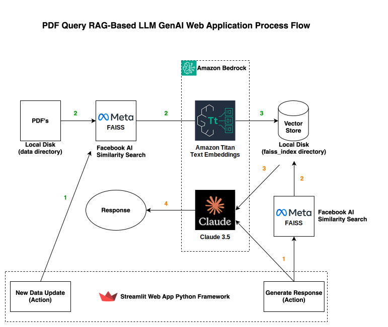

[](https://github.com/nethacker/pdf-query-rag-llm-app/actions/workflows/pylint.yml)
# PDF Query RAG-Based LLM APP
* License: (Apache 2.0), Copyright (C) 2024, Author Phil Chen (nethacker)
  * This is a example application the author of this repository is not liable for damages or losses arising from your use or inability to use the code.

### Description

This repo provides an example of a PDF query web application leveraging Generative AI that uses a <a href="https://en.wikipedia.org/wiki/Retrieval-augmented_generation" target="_blank">retrieval-augmented generation (RAG) process</a>. The importance of using RAG is the ability to scope the results of the generated response from the LLM in our case <a href="https://docs.anthropic.com/en/docs/about-claude/models" target="_blank">Claude 3.5 Sonnet</a> with up-to-date, accurate, reliable responses. RAG allows for domain-specific contextually relevant responses tailored to your data rather than static training data.

The PDF query web application will leverage <a href="https://ai.meta.com/tools/faiss/" target="_blank">Facebook AI Similarity Search (FAISS)</a> and <a href="https://docs.aws.amazon.com/bedrock/latest/userguide/titan-embedding-models.html" target="_blank">Amazon Titan Embeddings</a> to create vector representations of unstructured text and the storage/search of those embeddings. <a href="https://langchain.   com" target="_blank">LangChain</a> is utilized for the prompt template guiding the models response, RetrievalQA for pertinent data, and various PDF processing tools. We will use <a href="https://aws.amazon.com/bedrock/" target="_blank">Amazon Bedrock</a> to access Claude 3.5 Sonnet and Amazon Titan Embeddings.


<p align="center">

</p>

### Prerequisites for macOS laptop local setup

* <a href="https://aws.amazon.com" target="_blank"> Amazon Web Services Account</a>
* AWS CLI <a href="https://docs.aws.amazon.com/cli/latest/userguide/getting-started-quickstart.html" target="_blank">installed</a>
* AWS CLI user with Bedrock Access (Specifically Amazon Titan Embeddings and Claude 3.5 Sonnet) see: <a href="https://docs.aws.amazon.com/bedrock/latest/userguide/model-access.html" target="_blank">Manage access to Amazon Bedrock foundation models</a>
* Python 3.8 or higher
* Anaconda or Miniconda installed 
* AWS Default Region is set to us-east-1 you can change the region in the `pdf_query_rag_llm_app.py` file under `region_name='us-east-1'`

### Prerequisites for EC2 Ubuntu instance setup
* <a href="https://aws.amazon.com" target="_blank"> Amazon Web Services Account</a>
* Enable Amazon Bedrock Access (Specifically Amazon Titan Embeddings and Claude 3.5 Sonnet) see: <a href="https://docs.aws.amazon.com/bedrock/latest/userguide/model-access.html" target="_blank">Manage access to  Amazon Bedrock foundation models</a>
* EC2 Instance Role with AmazonBedrockFullAccess Policy Attached (note you can make this more secure by making a custom policy)
* EC2 Instance Ubuntu 20.04 or higher
* Virtualenv
* AWS Default Region is set to us-east-1 you can change the region in the `pdf_query_rag_llm_app.py` file under `region_name='us-east-1'`

### AWS Resource Cost

As with most AWS services you will incur costs for usage. 

* Pricing:
  * https://aws.amazon.com/bedrock/pricing/
  * https://aws.amazon.com/ec2/pricing/on-demand/

#### macOS laptop local setup

```
conda create -n "pdf-query-rag-llm-app" python=3.11.0

git clone git@github.com:nethacker/pdf-query-rag-llm-app.git

cd pdf-query-rag-llm-app

pip install -r requirements.txt
```

#### Run macOS laptop local setup

To run text PDF Query RAG LLM Application

```
streamlit run pdf_query_rag_llm_app.py
```

You can reach the app at `http://localhost:8501/`. Please put your PDF's that you want to query in the *data* directory and click *New Data Update* before querying.

### EC2 Ubuntu instance setup steps
(This example assumes you have a ubuntu user with /home/ubuntu)

#### Install some dependencies
```
sudo apt -y update

sudo apt -y install build-essential openssl

sudo apt -y install libpq-dev libssl-dev libffi-dev zlib1g-dev

sudo apt -y install python3-pip python3-dev

sudo apt -y install nginx

sudo apt -y install virtualenvwrapper
```

#### Clone the GIT repository
```
cd /home/ubuntu

git clone https://github.com/nethacker/pdf-query-rag-llm-app.git
```

#### Setup the Python environment
```
virtualenv pdf-query-rag-llm-app_env

source pdf-query-rag-llm-app_env/bin/activate
```

#### Install the PDF Query RAG LLM application package dependencies
```
cd /home/ubuntu/pdf-query-rag-llm-app

pip install -r requirements.txt
```

#### Setup systemd to daemonize and bootstrap the PDF Query RAG-Based LLM application (Port 8080)
```
sudo cp systemd/pdf-query-rag-llm-app.service /etc/systemd/system/

sudo systemctl start pdf-query-rag-llm-app

sudo systemctl enable pdf-query-rag-llm-app.service
```

#### Install NGINX to help scale and handle connections (Port 80)
```
sudo cp nginx/nginx_pdf-query-rag-llm-app.conf /etc/nginx/sites-available/nginx_pdf-query-rag-llm-app.conf

sudo rm /etc/nginx/sites-enabled/default

sudo ln -s /etc/nginx/sites-available/nginx_pdf-query-rag-llm-app.conf /etc/nginx/sites-enabled

sudo systemctl restart nginx
```

You can reach the app at `http://{yourhost}`. Please put your PDF's that you want to query in the *data* directory on the instance and click *New Data Update* before querying.

### Notes

* Make sure to open up port 80 in your EC2 Security Group associated to the instance.
* For HTTPS (TLS) you can use AWS ALB or AWS CloudFront
* Depending on how many PDF’s you have, how big the PDF’s are, and your CPU specifications using the New Data Update button can take awhile as it builds your vector embeddings.
* Any time you add PDF’s or change them make sure to click “New Data Update” to update/build your vector embeddings.
* This application does not take into consideration security controls, that is your responsibility.
* Please read <a href="https://aws.amazon.com/bedrock/faqs/" target="_blank">Amazon Bedrock FAQ's</a> for general questions about AWS LLM resources used.
